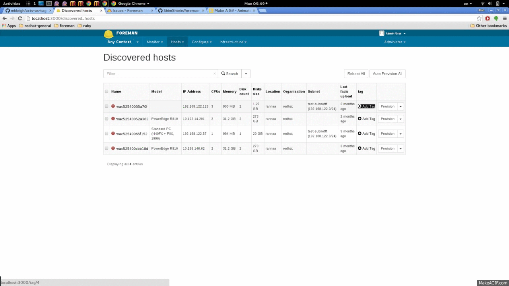

# ForemanTags

This plugin enables adding custom tags to hosts.

## Installation

Clone the project, add on your foreman gemfile , gem "foreman_tags", :path => "*foreman_tags_location", bundle.

## Usage
#### step 1:
rake acts_as_taggable_on_engine:install:migrations
#### step 2:
rake db:migrate
#### step 3:
The plguin will add a tag coulmn to your hosts views.

## TODO

*add a hammer_cli plugin
*enable search and query based on tags.

## Contributing

Fork and send a Pull Request. Thanks!

## Copyright

Copyright (c) *year* *your name*

This program is free software: you can redistribute it and/or modify
it under the terms of the GNU General Public License as published by
the Free Software Foundation, either version 3 of the License, or
(at your option) any later version.

This program is distributed in the hope that it will be useful,
but WITHOUT ANY WARRANTY; without even the implied warranty of
MERCHANTABILITY or FITNESS FOR A PARTICULAR PURPOSE.  See the
GNU General Public License for more details.

You should have received a copy of the GNU General Public License
along with this program.  If not, see <http://www.gnu.org/licenses/>.

